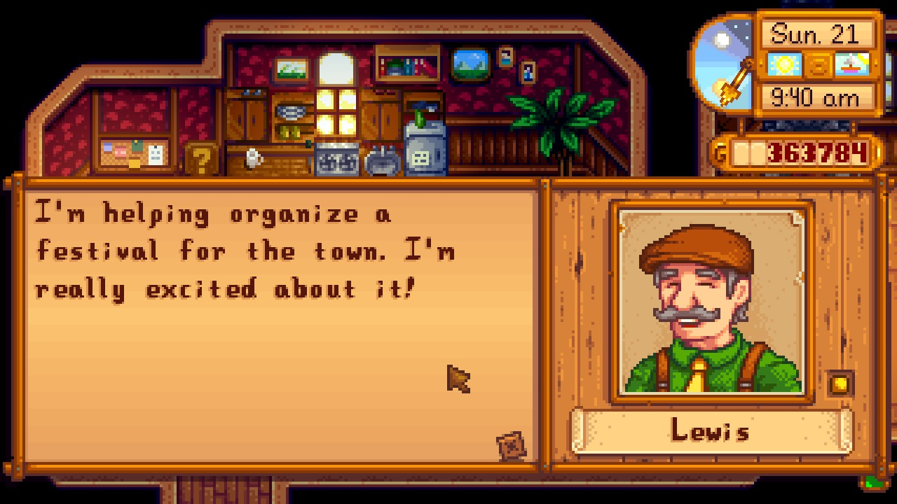

# **Stardew** 

StardewGPT enables immersive, AI-generated conversations with Stardew Valley NPCs. It uses GPT-3.5, the same engine powering ChatGPT, and therefore requires access to the OpenAI API to work.

## Disclaimer
StardewGPT is primarily a proof of concept. It is not recommended for a regular playthrough.

## Prerequisites
For general prerequisites for playing with Stardew Valley mods, see the [Player Guide](https://stardewvalleywiki.com/Modding:Player_Guide/Getting_Started) on the Stardew Valley Wiki.
If you don't have an OpenAI account yet, you can create one [here](https://beta.openai.com/signup).

## Getting started
1. Find the latest release of StardewGPT [here](https://github.com/HenriSchulte/StardewGPT/releases).
1. Download the file titled StardewGPT.zip.
1. Follow the [instructions in the player guide](https://stardewvalleywiki.com/Modding:Player_Guide/Getting_Started#Install_mods) to install the mod.
1. Find your OpenAI key on your [API keys page](https://platform.openai.com/account/api-keys).
1. Set the user environment variable on your operating system `OPENAI_API_KEY` to your key. [Here's how to do that on Windows](https://learn.microsoft.com/en-us/windows-server/administration/windows-commands/set_1).
1. Start the game with SMAPI and middle-click on a character to initiate an AI-generated conversation.

